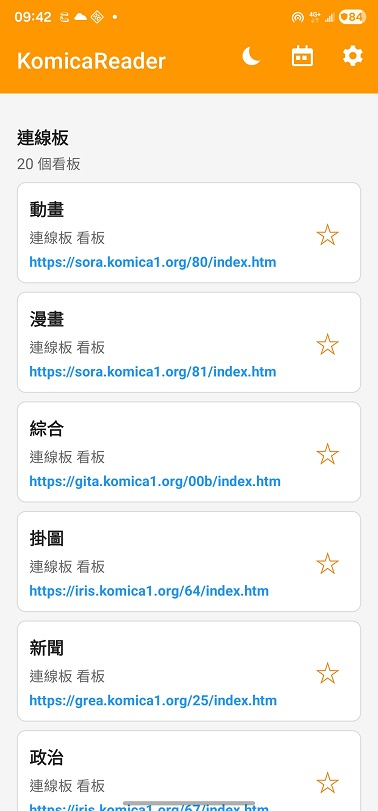
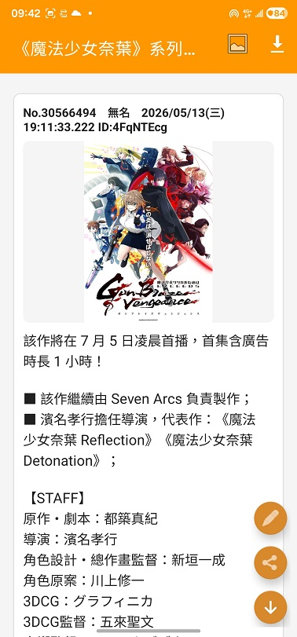
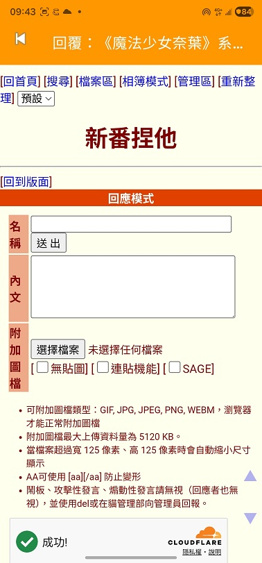

# KomicaReader

KomicaReader 是以 Android Kotlin 重製的 Komica 瀏覽器，專案可使用 Android Studio 開啟與編譯。

## 主要功能

- 看板清單與我的最愛
- 主題串讀取、排序、下拉重新整理與向下載入更多
- 討論串讀取、引用跳轉、引用長壓預覽與超連結偵測
- 圖片預覽、手勢切換、下載、分享與輪播
- 回覆頁面
- 歷史紀錄
- 深色 / 淺色模式切換
- 設定匯出與還原 JSON 備份

## 預覽圖片






## 編譯方式

使用 Android Studio 開啟此資料夾後同步 Gradle，或於命令列執行：

```powershell
.\gradlew.bat assembleDebug
```

Debug APK 會輸出到：

```text
app/build/outputs/apk/debug/app-debug.apk
```
